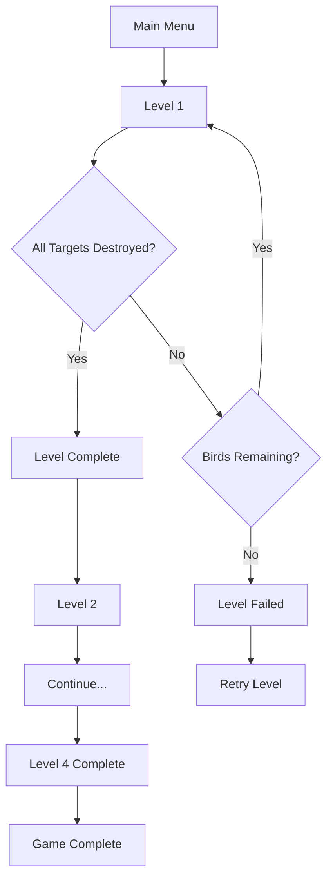

# Angry Birds 3D

A Unity-based 3D recreation of the classic Angry Birds slingshot mechanics with physics-based gameplay, multiple bird types, and progressive level difficulty.


## 🎮 Features

### Core Gameplay
- **Physics-Based Slingshot Mechanic**: Intuitive drag-and-pull system with realistic trajectory prediction
- **Multiple Bird Types**: Includes standard birds and special abilities (e.g., split mechanics)
- **Dynamic Target System**: Targets with health, damage calculation, and destruction effects
- **Progressive Level System**: 4+ levels with increasing difficulty
- **Score Management**: Cumulative scoring across levels with penalties for losses

### Visual & Audio
- **Animated Slingshot**: Idle, tension, and release animations
- **Elastic Band Rendering**: Dynamic LineRenderer-based slingshot bands
- **Particle Effects**: Destruction VFX for targets
- **3D Spatial Audio**: Directional sound effects for hits and impacts
- **Trajectory Visualization**: Real-time arc prediction while aiming

### UI/UX
- **Main Menu**: Clean interface with play and quit options
- **Pause System**: ESC to pause/resume with options menu
- **Win/Lose Screens**: Score display with level progression or retry options
- **Volume Control**: Adjustable audio settings
- **Score Display**: Real-time score tracking with level bonuses

## 🎯 Game Mechanics

### Slingshot Physics
- Pull back the bird to aim
- Release to launch with calculated velocity
- Trajectory arc shows predicted path
- Limited birds per level (default: 3)

### Damage System
- **Direct Hit**: 100% damage when bird collides with target
- **Indirect Hit**: 50% damage from debris or secondary collisions
- Impulse-based damage calculation for realistic physics

### Scoring
- **Target Destruction**: +100 points per target (configurable)
- **Level Complete**: Cumulative score carries over
- **Level Failed**: -200 point penalty
- **Final Score**: Total across all completed levels

### Bird Abilities
- **Standard Bird**: Basic projectile
- **Split Bird**: Click mid-flight to split into 3 birds with spread pattern

## 📁 Project Structure

```
Assets/
├── Scripts/
│   ├── BirdLaunch.cs           # Main bird drag/launch controller
│   ├── BirdSplitAbility.cs     # Special bird split ability
│   ├── SlingshotController.cs  # Slingshot animations & bands
│   ├── Target.cs               # Enemy health & destruction
│   ├── TargetManager.cs        # Level win/loss & scoring
│   ├── BirdManager.cs          # Bird spawning & lifecycle
│   ├── MainMenu.cs             # Main menu navigation
│   ├── PauseMenu.cs            # Pause/resume functionality
│   ├── OptionsMenu.cs          # Audio settings
│   └── ScoreManager.cs         # Score tracking system
├── Animations/                 # Slingshot animations
├── Materials/                  # 3D materials & textures
├── Prefabs/                    # Bird & target prefabs
└── Scenes/                     # Level scenes
```

## 🚀 Getting Started

### Prerequisites
- Unity 2022.3 or later
- TextMeshPro package (imported automatically)
- Basic understanding of Unity physics

### Installation

1. **Clone the repository**
   ```bash
   git clone https://github.com/yourusername/angry-bird-3d.git
   ```

2. **Open in Unity Hub**
   - Add project from disk
   - Select Unity 2022.3+ version
   - Open project

3. **Build Settings**
   - File → Build Settings
   - Add all level scenes in order:
     - Scene 0: Menu
     - Scene 1: Level 1
     - Scene 2: Level 2
     - Scene 3: Level 3
     - Scene 4: Level 4

4. **Play**
   - Open `Menu` scene
   - Press Play in Unity Editor

## 🎨 Setup Guide

### Creating a New Level

1. **Scene Setup**
   ```
   - Create new scene
   - Add ground plane
   - Place slingshot prefab
   - Add target objects with Target.cs component
   ```

2. **Required Components**
   ```
   - TargetManager (empty GameObject)
   - BirdManager (empty GameObject)
   - SlingshotController (on slingshot model)
   - Main Camera with FixedSlingshotCamera.cs
   ```

3. **UI Setup**
   ```
   - Canvas with TextMeshProUGUI for:
     - Score display
     - Win/Lose text
   - Pause menu panels
   ```

### Configuring Targets

```cs
// On each target GameObject:
Target.maxHealth = 10f;              // Health points
Target.scoreValue = 100;             // Points awarded
Target.minImpactForDamage = 2f;      // Minimum collision force
Target.destroyVFX = particlePrefab;  // Destruction effect
```

### Configuring Birds

```cs
// Standard bird settings:
BirdLaunch.maxPullDistance = 3f;
BirdLaunch.launchForceMultiplier = 10f;

// Split bird settings:
BirdSplitAbility.spreadAngle = 15f;
BirdSplitAbility.smallBirdPrefab = smallBirdPrefab;
```

## 🎮 Controls

| Input | Action |
|-------|--------|
| **Mouse Click + Drag** | Pull slingshot |
| **Mouse Release** | Launch bird |
| **Left Click (mid-flight)** | Activate bird ability |
| **ESC** | Pause/Resume |

## 📊 Game Flow



## 🔧 Customization

### Adjust Difficulty
- Modify `maxBirds` in TargetManager
- Increase target health in harder levels
- Adjust `impulseToDamage` multiplier

### Change Physics
- Edit `Physics` settings in Project Settings
- Adjust gravity scale
- Modify bird mass and drag

### Modify Scoring
```cs
// In TargetManager.cs
public static int loseScorePenalty = 200;  // Loss penalty
public int scorePerTarget = 100;           // Points per target
```

## 🐛 Known Issues

- Birds may occasionally pass through thin objects at high speeds
- Audio may overlap if multiple targets are destroyed simultaneously
- Split birds despawn after 4 seconds (intentional design)

## 🤝 Contributing

Contributions are welcome! Please follow these steps:

1. Fork the repository
2. Create a feature branch (`git checkout -b feature/AmazingFeature`)
3. Commit changes (`git commit -m 'Add AmazingFeature'`)
4. Push to branch (`git push origin feature/AmazingFeature`)
5. Open a Pull Request

## 📝 License

This project is licensed under the MIT License - see the [LICENSE](LICENSE) file for details.

## 🙏 Acknowledgments

- Inspired by Rovio's Angry Birds franchise
- Unity physics system
- TextMeshPro for UI rendering
- Community tutorials and documentation
---

**Made with Unity**
